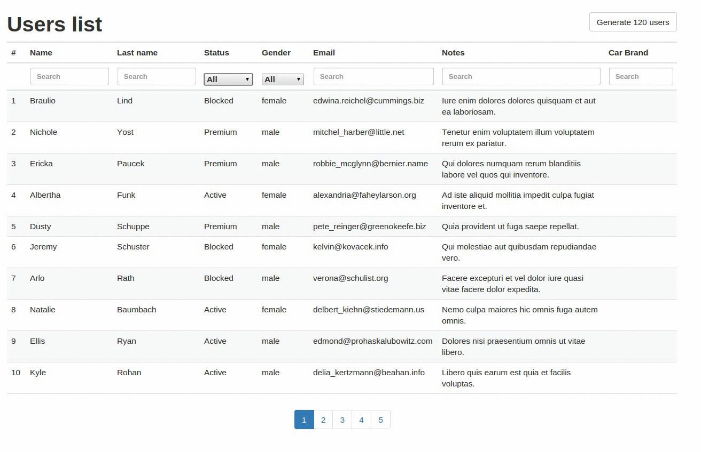

# Gridzzly

## Intro
Gridzzly is small library which allows you to paginate, sort and filter data with slick functional relation mapper.
Current version works with slick and Play Framework. It could be used for easier integration with frontend tables.

 

## Quick reference

Given users table:

```scala
class UsersTable(tag: Tag) extends Table[User](tag, "users"){
  def id = column[Long]("id", O.PrimaryKey, O.AutoInc)
  def email = column[String]("email")
  def firstName = column[String]("first_name")
  def lastName = column[String]("last_name")
  def status = column[Int]("status")
  def gender = column[Int]("gender")
  def salary = column[Long]("salary")
  def notes = column[String]("notes")

  def * = (id.?, email, firstName, lastName, status, gender,salary, notes) <> ((User.apply _).tupled, User.unapply)
}
```

Where User is:

```scala
case class User( id: Option[Long],
                 email: String,
                 firstName: String,
                 lastName: String,
                 status: Int,
                 gender: Int,
                 salary: Long,
                 notes: String)
```

You want to build endpoint to list all users with option to filter, sort and paginate this data. To do this implement
similar case class with annotation @Gridzzly:
```scala
@Gridzzly
case class UsersGrid() extends Grid[UsersTable, User, Seq]{
  val query = for {
    user <- TableQuery[UsersTable]
  } yield user

  val columns = Seq(
    GridColumn[UsersTable, String]("First name", user => user.firstName),
    GridColumn[UsersTable, String]("Last name", user => user.lastName),
    GridColumn[UsersTable, Int]("Status", user => user.status, Equals()),
    GridColumn[UsersTable, Int]("Gender", user => user.gender, Equals()),
    GridColumn[UsersTable, String]("Notes", user => user.notes),
    GridColumn[UsersTable, Long]("Salary", user => user.salary),
    GridColumn[UsersTable, String]("Email", user => user.email))

  val defaultSortBy = DefaultGridColumn[UsersTable, Long](user => user.id.desc)
}
```

What is important:

1. This UsersGrid class needs to extends trait Grid[A, B, C[_]] where A, B, C are type parameters of val query. Those
    type parameters are necessary.

2. You have to implement 3 val's: query, columns and defaultSortBy.

    A) val query is your query to get all needed data. In our simple example where we need all users we just grab them
    without joins. What is important query must by implemented with for comprehension, and returning type of query should
    be tables.

    B) in val columns you specify by which columns you will sort and filter your data.

    C) val defaultSortBy specifies default sort.

Now if you want to sort and filter you can do this by invoking run method of UsersGrid() and pass it GridConditions object:
```scala
case class GridConditions(page: Int, perPage: Int, sortBy: String, sortDir: String, filterBy: FilterColumns)
```
Where FilterColumns is simple wrapper around filter parameters with field columns: Map[String, String], where key is
column name and value is value you want to filter by. What is important key should has be the form of the body of the second parameter
of GridColumn so for example: user.firstName or user.email or user.salary

```scala
case class FilterColumns(columns: Map[String, String])
```

So GridConditions is wrapper around pagination, sorting and filtering Parameters. Example usage:
```scala
val conditions = GridConditions(1, 10, "user.email", "desc", FilterColumns(Map("user.email"->"someemail@", "user.firstName" -> "Bob")))

val result: (Future[Seq[User]], Future[Int]) = UsersGrid().run(conditions)
```
val result is a tuple where first element is Future with sequence of sorted, filtered, paginated users data. Second value
is amount of all users in database. This second value is useful when you are building pagination in frontend and you need this information.

You need to pass somehow those values for GridConditions, you can build endpoint which accepts those. Example url:

```
    http://localhost:9001/api/users?page=1&perPage=10&sortBy=user.email&sortDir=desc&filterBy[user.email]=adelber&filterBy[user.firstName]=kaylah
```

For working end to end example with frontend and backend implemented look at this repository [here](https://github.com/JAVEO/gridzzly-example).


